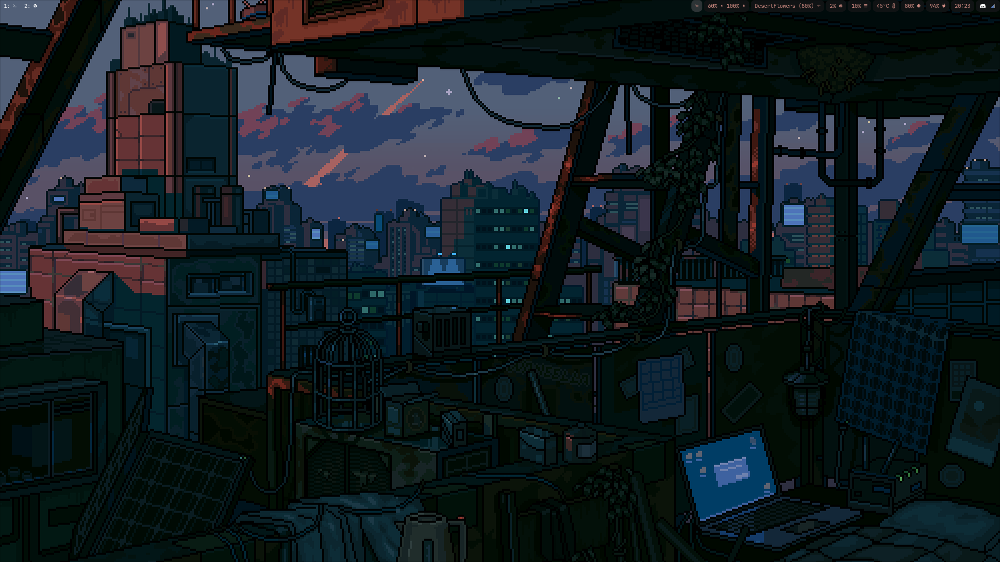

# sam's dots

*featuring*
- hyprland
- hyprpaper
- swww
- hyprlock
- kitty
- rofi
- tofi
- waybar
- bashrc
- nnn
- wallpapers
- dunst

## information
the hyprland config is split up into separate files so i can easily edit individual parts of the configuration and not deal with a very log file.
- keybinds.conf manages the keybinds
- appearance.conf manages settings like border-radius, gaps, and border-colors
- launch.conf controls apps on launch
- monitors.conf controls monitor settings
- hyprland.conf, of course, brings everything together

## how to do it
*it's a breeze*

after files are edited:

`git add .config/hypr/hyprland.conf` or whatever files you edited

to commit changes:

`git commit -m "commit message"`

to push changes:

`git push origin main` to force it pass -f

if you don't have the files:

`git clone git@github.com:name/dots.git .` the dot specifies that the files go here

if you need to get new changes:

`git pull origin main` 

#### wallpaper credit
- [waneella](https://www.waneella.com/) 
